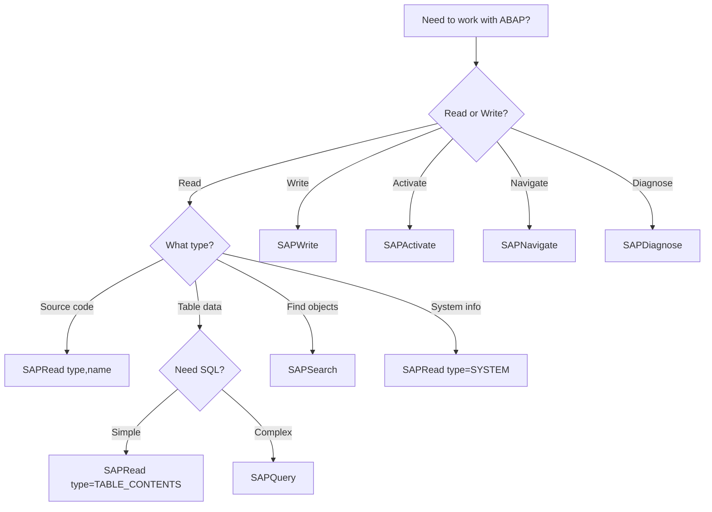
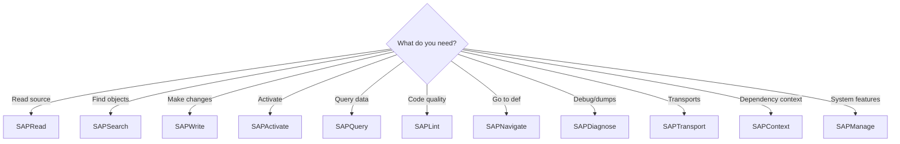

# MCP Usage Guide for AI Agents

**Target Audience:** AI assistants (Claude, GPT, etc.) using this MCP server for ABAP development.

**Purpose:** Machine-friendly reference for optimal tool usage patterns, workflows, and best practices.

---

## Critical Limitations (Read First!)

### SQL Query Limitations (SAPQuery)

The SAP ADT Data Preview API uses **ABAP SQL syntax**, NOT standard SQL:

| Feature | Status | Syntax |
|---------|--------|--------|
| `ORDER BY col` | **Works** | `ORDER BY field_name` |
| `ORDER BY col ASCENDING` | **Works** | ABAP keyword |
| `ORDER BY col DESCENDING` | **Works** | ABAP keyword |
| `ORDER BY col ASC` | **FAILS** | SQL standard - not supported |
| `ORDER BY col DESC` | **FAILS** | SQL standard - not supported |
| `LIMIT n` | **FAILS** | Use `maxRows` parameter instead |
| `GROUP BY` | **Works** | `GROUP BY field_name` |
| `COUNT(*)` | **Works** | Aggregate functions work |
| `WHERE` | **Works** | Standard conditions |

**Correct Example:**
```sql
SELECT carrid, COUNT(*) as cnt FROM sflight GROUP BY carrid ORDER BY cnt DESCENDING
```

**Wrong Example (will fail):**
```sql
SELECT carrid, COUNT(*) as cnt FROM sflight GROUP BY carrid ORDER BY cnt DESC
```

### Object Type Coverage (SAPRead)

| Object Type | Read | Notes |
|-------------|:----:|-------|
| PROG (Program) | **Y** | Full support |
| CLAS (Class) | **Y** | Includes: definitions, implementations, testclasses |
| INTF (Interface) | **Y** | Full support |
| FUNC (Function Module) | **Y** | Requires `group` (function group) |
| FUGR (Function Group) | **Y** | Returns JSON metadata |
| INCL (Include) | **Y** | Read-only |
| DDLS (CDS DDL Source) | **Y** | CDS view definitions |
| BDEF (Behavior Definition) | **Y** | RAP behavior definitions |
| SRVD (Service Definition) | **Y** | RAP service definitions |
| TABL (Table Definition) | **Y** | Table structure |
| VIEW (DDIC View) | **Y** | Dictionary views |
| TABLE_CONTENTS | **Y** | Table data with SQL filtering |
| DEVC (Package) | **Y** | Package contents |
| SYSTEM | **Y** | System info (SID, release) |
| COMPONENTS | **Y** | Installed software components |
| MESSAGES | **Y** | Message class texts |
| TEXT_ELEMENTS | **Y** | Program text elements |
| VARIANTS | **Y** | Program variants |

---

## Tool Selection Decision Tree



---

## Quick Reference

### Reading Objects

| Task | Tool | Parameters |
|------|------|------------|
| Read program | `SAPRead` | `type=PROG, name=ZTEST` |
| Read class | `SAPRead` | `type=CLAS, name=ZCL_TEST` |
| Read class definitions | `SAPRead` | `type=CLAS, name=ZCL_TEST, include=definitions` |
| Read class tests | `SAPRead` | `type=CLAS, name=ZCL_TEST, include=testclasses` |
| Read interface | `SAPRead` | `type=INTF, name=ZIF_TEST` |
| Read function module | `SAPRead` | `type=FUNC, name=Z_FM, group=ZFUGR` |
| Read function group | `SAPRead` | `type=FUGR, name=ZFUGR` |
| Read CDS view | `SAPRead` | `type=DDLS, name=ZDDL_VIEW` |
| Read message class | `SAPRead` | `type=MESSAGES, name=ZMSG` |
| Read table structure | `SAPRead` | `type=TABL, name=MARA` |
| Read table data | `SAPRead` | `type=TABLE_CONTENTS, name=MARA, maxRows=10` |
| System info | `SAPRead` | `type=SYSTEM` |
| Installed components | `SAPRead` | `type=COMPONENTS` |

### Searching

| Task | Tool | Parameters |
|------|------|------------|
| Find objects by name | `SAPSearch` | `query=ZCL_ORDER*` |
| Find with wildcard | `SAPSearch` | `query=Z*TEST*, maxResults=20` |

### Writing

| Task | Tool | Parameters |
|------|------|------------|
| Create new object | `SAPWrite` | `action=create, type=PROG, name=ZTEST, source=...` |
| Update existing | `SAPWrite` | `action=update, type=CLAS, name=ZCL_TEST, source=...` |
| Delete object | `SAPWrite` | `action=delete, type=PROG, name=ZTEST` |
| Activate | `SAPActivate` | `name=ZCL_TEST, type=CLAS` |

### Querying

| Task | Tool | Parameters |
|------|------|------------|
| Simple query | `SAPQuery` | `sql="SELECT * FROM t000"` |
| Filtered query | `SAPQuery` | `sql="SELECT * FROM sflight WHERE carrid = 'LH'"` |
| Aggregation | `SAPQuery` | `sql="SELECT carrid, COUNT(*) as cnt FROM sflight GROUP BY carrid ORDER BY cnt DESCENDING"` |

---

## Common Workflows

### 1. Read and Understand a Class

```
Step 1: SAPRead(type="CLAS", name="ZCL_ORDER")
        → Returns full class source

Step 2: SAPRead(type="CLAS", name="ZCL_ORDER", include="testclasses")
        → Returns unit test source

Step 3: SAPContext(name="ZCL_ORDER", type="CLAS")
        → Returns compressed dependency context (7-30x smaller)
```

### 2. Read CDS View and Dependencies

```
Step 1: SAPRead(type="DDLS", name="ZRAY_00_I_DOC_NODE_00")
        → Returns CDS source code

Step 2: SAPRead(type="TABL", name="ZLLM_00_NODE")
        → Returns table structure
```

### 3. Understand Error Messages

```
Step 1: SAPRead(type="MESSAGES", name="ZRAY_00")
        → Returns JSON with all messages
```

### 4. Investigate Runtime Errors

```
Step 1: SAPDiagnose(action="dumps", user="DEVELOPER")
        → Returns list of short dumps

Step 2: SAPDiagnose(action="dump_detail", name="<dump_id>")
        → Returns full dump with stack trace
```

---

## Error Handling

### SAPQuery Errors

| Error | Cause | Solution |
|-------|-------|----------|
| `"DESC" is not allowed` | Used SQL `DESC` | Use `DESCENDING` instead |
| `"ASC" is not allowed` | Used SQL `ASC` | Use `ASCENDING` instead |
| `LIMIT not recognized` | Used SQL `LIMIT` | Use `maxRows` parameter |

### SAPRead Errors

| Error | Cause | Solution |
|-------|-------|----------|
| 404 Not Found | Object doesn't exist | Check name with SAPSearch first |
| Missing `group` | FUNC without function group | Provide `group` parameter |

---

## Performance Tips

### Token Optimization

| Operation | Tokens | Better Alternative |
|-----------|--------|-------------------|
| SAPRead full class (500 lines) | ~2,500 | SAPContext (compressed) ~500 |
| SAPRead then SAPRead deps | ~5,000 | SAPContext with depth=2 ~800 |

### Search Strategy

1. **Start with SAPSearch:** Find objects by name pattern
2. **Use SAPRead selectively:** Read only the objects you need
3. **Use SAPContext for deps:** One call = source + dependency context
4. **Limit SAPQuery results:** Use `maxRows` to prevent overwhelming responses

---

## Summary: When to Use What



---

**Maintained by:** ARC-1 project
